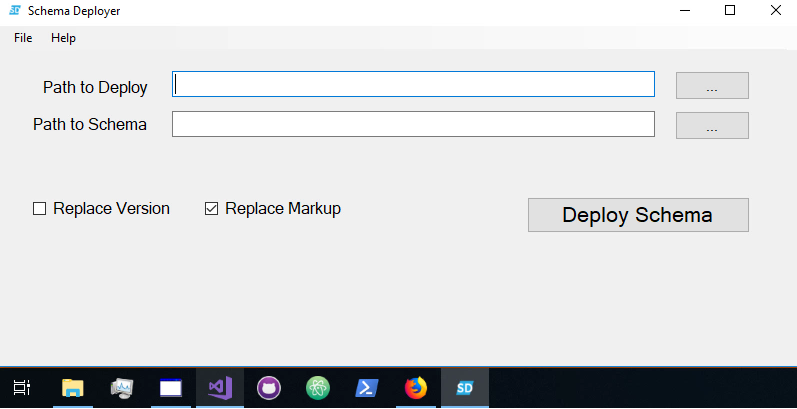
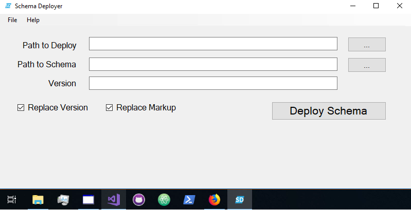
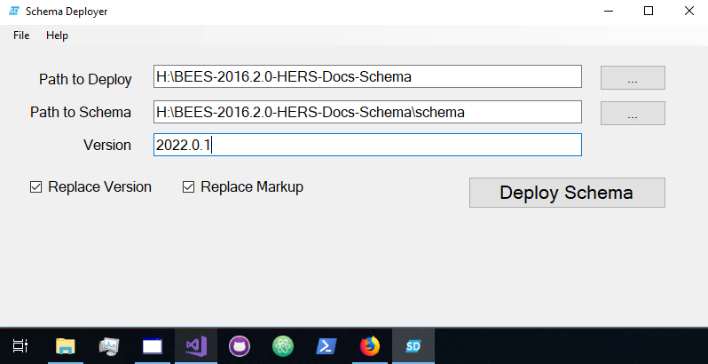
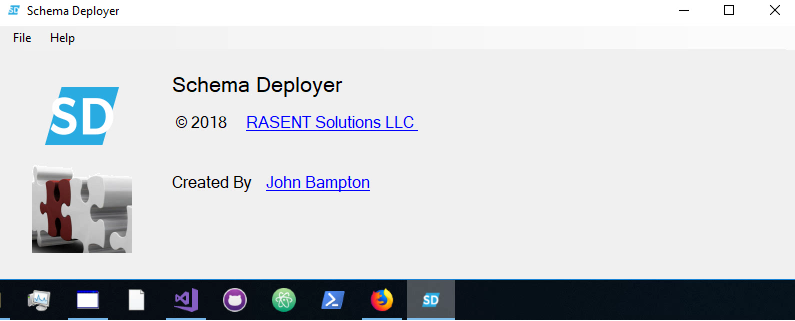

# CONTRIBUTING

The [README](README.md) and this contributing guide are both written in 
[Markdown](https://guides.github.com/features/mastering-markdown/) which is a lightweight and easy-to-use syntax for styling 
all forms of writing on the GitHub platform.

Discussion about code base improvements happens in GitHub issues and on pull requests.

- [Contributor Workflow](#contributor-workflow)
- [GitHub Cheat Sheets](#github-cheat-sheets)
- [More Git Information](#more-git-information)
- ["Decision Making" Process](#decision-making-process)
- [Helpful Information](#helpful-information)

## Contributor Workflow

To contribute a patch, the workflow is as follows:

- Fork repository
- Create topic branch
- Commit patches
- Push changes to your fork
- Create pull request

If a commit references an issue, please add the reference. 
For example: `refs #321` or `fixes #12`. Using the `fixes` or `closes` keywords will cause the applicable issue to be closed when the pull request is merged.

## GitHub Cheat Sheets 

- [Awesome](https://github.com/tiimgreen/github-cheat-sheet)
- [GitHub Git Cheat Sheet](https://services.github.com/on-demand/downloads/github-git-cheat-sheet.pdf)
- [Tower](https://www.git-tower.com/blog/git-cheat-sheet)

## More Git Information

Refer to the [Git manual](https://git-scm.com/doc) for more information about Git.

Git comes with built-in GUI tools for committing (git-gui) and browsing (gitk).
To run them open your repository in Git Bash and type:
```
$ git gui
```
or
```
$ gitk
```

Other Free Git GUI clients:

- [GitHub Desktop](https://desktop.github.com/)
- [Sourcetree](https://www.sourcetreeapp.com/)

Commercial Git GUI clients:

- [GitKraken](https://www.gitkraken.com/git-client)
- [Tower](https://www.git-tower.com/)

### Essential Git commands

So you have just cloned your Fork from GitHub and the first Git
command you should try is:
```
$ git branch
* master
```
Now you want to submit a patch or new feature so you can create
a new branch by using:
```
$ git checkout -b feature-branch
Switched to a new branch 'feature-branch'
```
And now the `git branch` command lists two local branches with the
current branch highlighted by the `*`:
```
$ git branch
* feature-branch
  master
```
When creating a pull request you need to create a new branch or
more technically a `feature branch`.  In the above example the 
`feature-branch` is a new branch, but you should try to be more 
descriptive when naming the new feature branch.

Another useful command is `git status`.  
```
$ git status
  On branch docs
  Changes not staged for commit:
    (use "git add <file>..." to update what will be committed)
    (use "git checkout -- <file>..." to discard changes in working directory)
  
          modified:   CONTRIBUTING.md
  
  no changes added to commit (use "git add" and/or "git commit -a")
```

The `origin` and the `upstream` are displayed below for a GitHub user. You
should think of the upstream as the source and the origin as your fork on GitHub.
```
$ git remote -v
origin  https://github.com/jbampton/2019-HERS-Documents-Schema.git (fetch)
origin  https://github.com/jbampton/2019-HERS-Documents-Schema.git (push)
upstream        https://github.com/RASENTSolutionsLLC-CEC/2019-HERS-Documents-Schema.git (fetch)
upstream        https://github.com/RASENTSolutionsLLC-CEC/2019-HERS-Documents-Schema.git (push)
```

The Git log command is shown below and it contains the history of the past commits:
```
$ git log
commit 942fbcae19ae2e2cd4c1b3a071cdb9932acebbc0 (HEAD -> rubycritic-report, upstream/master, origin/master, origin/HEAD, master)
Merge: a2df06d b717e7e
Author: John Bampton <jbampton@users.noreply.github.com>
Date:   Sat Jan 12 14:10:26 2019 +1000

    Merge pull request #39 from jbampton/excel-report

    Add Excel report built with Ruby.
```
Another useful command is: git diff
```
$ git diff
diff --git a/README.md b/README.md
index 2821648..5f7ec95 100644
--- a/README.md
+++ b/README.md
@@ -9,20 +9,20 @@ Get started here [CONTRIBUTING](CONTRIBUTING.md)

 We have two reports located in the `tools\output` directory.

-- Excel report with charts which reports on the files in the repository
-- Web based report using mainly HTML, JavaScript and CSS that reports on the Ruby code
+- **Excel** report with charts which reports on the files in the repository
+- **Web based** report using mainly HTML, JavaScript and CSS that reports on the Ruby code
```

#### Sync your fork
Refer to the GitHub help article on **[Syncing a fork](https://help.github.com/articles/syncing-a-fork/)**.
```
$ git checkout master
$ git fetch upstream
$ git merge upstream/master
```
You will then need to push your changes back up to your fork on GitHub.

## Decision Making Process

The project merge maintainers and ultimately the project lead are responsible for deciding whether
a pull request is merged.

## Helpful Information

- [Free Training](#training)
- [Free Short Intro Courses on Git/Shell](#courses)

### Training

- [GitHub Learning Lab](https://lab.github.com/)
- [Codewars](https://www.codewars.com/) - Train on kata in the dojo and reach your highest potential

### Courses

- [Codecademy - Learn Git](https://www.codecademy.com/learn/learn-git)
- [DataCamp - Introduction to Git for Data Science](https://www.datacamp.com/courses/introduction-to-git-for-data-science)
- [Codecademy - Learn the Command Line](https://www.codecademy.com/learn/learn-the-command-line)
- [DataCamp - Introduction to Shell for Data Science](https://www.datacamp.com/courses/introduction-to-shell-for-data-science)
- [Codecademy - Learn Ruby](https://www.codecademy.com/learn/learn-ruby)

### Free Awesome IDE's

- [IntelliJ IDEA Community](https://www.jetbrains.com/idea/download)
- [Atom](https://atom.io/)

#### Schema Deployer - Experimental !!!








